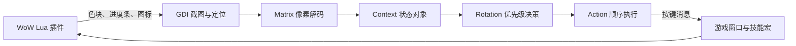

<p align="center">
  
</p>

<h1 align="center">PixProtection</h1>

<p align="center"><strong>铸光防骑 · 像素读取 · 自动循环</strong></p>
<p align="center">Lua 显示战斗状态，Python 读取像素，按优先级执行技能。</p>

<p align="center">
  
  
  
  <a href="LICENSE"></a>
</p>

## 项目简介

PixProtection 是运行在 Windows 上的《魔兽世界》铸光防骑像素循环工具，由游戏内 Lua 插件和 Python 桌面程序组成。插件将圣能、法力、充能、增益和单位状态等信息显示为色块、进度条与图标；桌面程序截图解码后，执行手写循环并向游戏窗口发送按键。

- **专注铸光防骑**：围绕铸光者防御圣骑士编写一套优先级循环，包含自疗、打断、防护与输出技能。
- **目标与焦点协同**：部分攻击技能按射程检查目标与焦点，优先选择目标；打断支持焦点和目标。
- **按需控制**：游戏内启停、爆发计时、输出模式、自疗阈值、清毒与饰品开关，以及可编辑的打断黑名单。
- **运行状态可见**：桌面端分别控制截图和循环，显示定位状态、动作与错误日志。
- **便于修改**：像素协议、状态对象、循环决策和按键执行各自独立，规则集中在一个 Python 文件中。

## 快速开始

### 1. 准备环境

| 项目 | 要求 |
| --- | --- |
| 操作系统 | Windows，截图和按键驱动使用 Windows API |
| Python | 3.13，使用 uv 管理环境与依赖 |
| 游戏 | 《魔兽世界》正式服，铸光防骑 |
| 客户端语言 | 当前技能宏使用简体中文名称 |
| 插件版本 | 当前 TOC 声明 Interface `120100`、版本 `12.1.0.69933`；这是仓库声明的版本，不代表其他版本已验证 |

先安装 Git 和 uv，然后在 PowerShell 中运行：

```powershell
git clone https://github.com/liantian-cn/PixWOW.git
cd PixWOW
uv sync --locked
cd PixProtection
```

### 2. 安装游戏插件

启动游戏，再在项目目录中启动桌面程序：

```powershell
uv run pythonw -m pix
```

1. 等待桌面程序识别游戏进程并显示游戏目录。
2. 点击 **拷贝插件**，将 `pix/lua/` 下的**每一个文件和子目录**复制到该游戏目录中的 `Interface/AddOns/PixProtection/`。
3. 看到复制成功提示后，在游戏内执行 `/reload`，确认插件已启用并显示控制面板。

程序会自动创建目录、覆盖同名文件，并保留目标中的额外文件。更新插件时也可以使用此按钮；游戏未运行时按钮不可用。若复制失败，请根据错误提示处理后重试。

<details>
<summary><strong>手动安装（备用方式）</strong></summary>

也可以将仓库中 `pix/lua/` 的**全部内容**复制到游戏目录下，保留所有子目录、字体和图片文件：

```text
World of Warcraft/
└── _retail_/
    └── Interface/
        └── AddOns/
            └── PixProtection/
                ├── PixProtection.toc
                ├── macro.lua
                ├── core/
                ├── cells/
                └── ui/
```

确认 `PixProtection.toc` 直接位于 `AddOns/PixProtection/` 下，启用插件并在游戏内执行 `/reload`。

</details>

插件加载时会自动绑定技能组合键，并调整部分游戏 CVar，包括 UI 缩放、抗锯齿、亮度、对比度和镜头设置。具体设置见 [core/base.lua](pix/lua/core/base.lua)，键位见 [macro.lua](pix/lua/macro.lua)。

### 3. 启动截图与循环

安装完成后，继续使用已打开的桌面程序；如果采用手动安装且尚未启动程序，先运行 `uv run pythonw -m pix`。

1. 进入游戏，保持插件像素区域在桌面上可见、不被遮挡。
2. 点击桌面程序的 **启动截图**，查看定位状态。
3. 确认游戏内插件处于 **已启动** 状态，再点击桌面程序的 **启动循环**。
4. 进入战斗并选择可攻击目标，循环按当前状态执行技能。

点击 **停止循环** 可以保留截图观察；点击 **停止截图** 会先停止循环。重新启动截图后，需要手动再次启动循环。

## 配置与控制

### 桌面端

| 设置 | 默认值 | 范围 / 行为 |
| --- | --- | --- |
| 截图 FPS | 25 | 15–35 |
| Action 基础 FPS | 10 | 8–16；普通循环间隔在基础间隔的 ±50% 范围内随机浮动 |
| 游戏进程 | 自动发现 | 选择第一个 `wow.exe`，进程退出后重新查找 |
| 配置保存 | 当前运行期间 | 重启桌面程序后恢复默认值 |

### 游戏内

插件控制面板提供启停按钮和“配置”入口，可调整输出模式、荣耀圣令阈值，以及自动清毒和自动饰品开关。**打断黑名单**按法术 ID 配置，按 ID 升序取前 15 项参与图标匹配。

这些配置通过 WoW 的 `PixProtectionDB` 保存；插件启停、爆发与延迟计时属于运行时状态。

| 命令 | 作用 |
| --- | --- |
| `/pix` | 显示命令帮助 |
| `/pix toggle` | 切换插件启停状态 |
| `/pix disable` | 关闭插件，循环返回空闲动作 |
| `/pix burst` | 开启 15 秒爆发窗口 |
| `/pix burst 30` | 设置 30 秒爆发窗口 |
| `/pix burst 0` | 结束爆发窗口 |
| `/pix delay 0.4` | 暂停全部自动动作 0.4 秒；省略秒数也是 0.4 秒 |

职业与专精匹配时，插件加载后默认启用，并初始化 60 秒爆发窗口。爆发窗口控制戒卫、圣洁鸣钟、军备和自动饰品，具体技能是否使用仍取决于循环条件。

## 工作原理



截图线程发布最新帧，Action 线程顺序完成解码、决策和执行。循环按规则顺序首次命中返回一个动作；没有满足条件的规则时返回 `Idle`。截图失败或帧龄超过 0.5 秒时，不执行该帧对应的按键动作。

当前解码器匹配 Lua 正式模式的 **4 px Cell、12 px 高基板**。像素位置和字段含义见 [.context/layout.md](.context/layout.md)，请保持插件与 Python 代码来自同一版本。

## 文档导航

| 文档 | 内容 |
| --- | --- |
| [layout.md](.context/layout.md) | 像素布局、字段与编码 |
| [keymap.md](.context/keymap.md) | 完整键位与宏目标 |
| [rotation.md](.context/rotation.md) | 循环优先级、条件与设计约定 |
| [CHANGELOG.md](CHANGELOG.md) | 后续更新记录 |
| [banner.prompt.md](.context/banner.prompt.md) | 横幅提示词与来源说明 |

修改项目时遵循 [根 AGENTS.md](../AGENTS.md)。详细键位和循环规则集中维护在 `.context`。

## 开发与检查

| 模块 | 职责 |
| --- | --- |
| [pix/lua/](pix/lua/) | 游戏内状态显示、控制面板与技能宏 |
| [pix/capture.py](pix/capture.py) | GDI 截图、像素区域定位与截图线程 |
| [pix/matrix.py](pix/matrix.py) | 色块、进度条和图标解码 |
| [pix/context.py](pix/context.py) | 将解码结果转换为循环使用的状态属性 |
| [pix/rotation.py](pix/rotation.py) | 唯一的手写循环与键位映射 |
| [pix/action.py](pix/action.py) | 动作类型与顺序执行线程 |
| [pix/keyboard.py](pix/keyboard.py) | 向指定游戏进程窗口发送按键消息 |
| [pix/ui.py](pix/ui.py) | PySide6 界面、进程发现与线程生命周期 |
| [pix/__main__.py](pix/__main__.py) | 应用入口 |

修改循环时，从 `Rotation.main_rotation(ctx)` 入手。返回值为 `Cast(name, note=None)`、`Use(name, note=None)`、`Idle(reason)` 或 `Sleep(reason, seconds=1)`；`Cast` 和 `Use` 的名称必须存在于 `keymap` 中。需要等待时返回 `Sleep`，实际等待时间限制为 1–15 秒，避免在循环函数中阻塞线程。

每次启动循环都会创建一个 `Rotation` 实例。运行错误或游戏进程重开不会重建该实例；修改代码后请重启桌面程序。修改像素布局时，同步更新 Lua 显示端、Python 解码端和 `.context/layout.md`，并保留 TOC 的加载顺序。

### 本地检查

```powershell
uv run pyright pix
uv run python -m compileall pix
git diff --check
```

仓库目前没有自动化测试框架。Lua 显示、布局和状态切换需要在游戏内 `/reload` 后验证。

## 常见问题

**为什么提示重载，或重载后插件不见了？**

加载时职业或专精不匹配，插件会禁用自身并提示重载；切换专精也会提示重载。每个插件每次界面加载最多提示一次，等待重载期间循环保持关闭。点击“重载界面”完成重载；切回对应专精后，需要在游戏插件列表中手动重新启用对应插件，再执行 `/reload`。插件不会自动启用其他 Pix 插件。

**截图定位失败？**

确认插件已经加载、像素区域完整可见，且 `pix/lua/core/base.lua` 中 `debug = false`。调试模式会放大像素区域，不符合当前解码器的尺寸要求。可以先运行一次只截图、不发送按键的诊断：

```powershell
uv run python -m pix.test_captura
```

诊断会输出定位坐标和区域宽高，或具体失败原因。

**截图正常，但循环没有动作？**

确认已单独点击“启动循环”，游戏内插件已启用，角色处于战斗并选中了存活、可攻击的目标。查看日志中的 `Idle` 原因；正在施法、引导、蓄力或没有满足技能条件时，循环会等待。

**有动作日志，但技能没有施放？**

检查游戏进程、客户端语言和宏绑定是否匹配。技能还受射程、资源与冷却限制；动作日志表示程序选择了该动作，不表示游戏已确认施法成功。

**能否用于其他职业、怀旧服或非中文客户端？**

当前实现只围绕正式服铸光防骑的一套循环维护。其他职业和版本没有适配；非中文客户端需要调整宏中的技能名称。

## 共用环境与构建

本项目共用 [PixWOW 根目录](../README.md) 的 Python 3.13、依赖、锁文件和 `.venv`。安装依赖在根目录运行 `uv sync --locked`；运行与检查命令在 `PixProtection` 子目录执行，工作目录决定加载哪份 `pix`。

`build.py`、`build.ps1` 仍读取原子目录的 `pyproject.toml` 和 `uv.lock`，需后续适配后才能打包。

## 许可与配图

本项目采用 [GNU GPLv3](LICENSE)。横幅位于 [banner.png](banner.png)，提示词与来源说明见 [.context/banner.prompt.md](.context/banner.prompt.md)。
